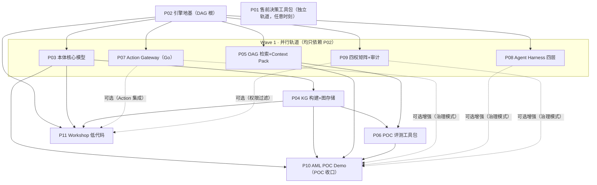

# AgenticX-OAG 产品形态与企业落地路径

> 回答两个问题：它到底是什么形态的产品？怎么卖给企业、怎么落地？
>
> 版本：v0.3（2026-09）——v0.3 新增「八、Subplan 拆解与 DAG 执行路径」：把本文档拆为 11 个可独立实施的 subplan（P01–P11，落盘 `.cursor/plans/pending/`），定义依赖 DAG、执行波次与管理流程。
> 版本：v0.2（2026-09）——v0.2 依据《本体论紫皮书》（刘焕勇，2026-08）四象框架校准定位，吸收其选型决策树、场景匹配表与组合模式，解析版见仓库根目录《本体论紫皮书：四.md》。

***

## 一、它不是单一产品，是「引擎 + 平台 + 应用」三层

很多人第一次接触会问：这是个 SaaS 吗？是个库吗？是个低代码平台吗？答案是——**都是，也都不是。它是分层的，不同阶段面向不同角色。**

### 第一层：OAG Engine（引擎层）——开发者面向

**形态**：Python 包（`pip install agenticx-oag`）+ AgenticX Extension

**是什么**：

- 嵌入 AgenticX 的本体增强生成引擎

- 提供本体管理、KG 构建、OAG 检索、Context Pack、Action Gateway 等核心能力

- 开发者 import 进来用，或者通过 AgenticX 的 skill/memory 机制调用

**对标**：Semantica（但更强，因为有治理层）

**谁用**：后端工程师、AI 工程师、Agent 开发者

***

### 第二层：Ontology Platform（平台层）——运维/架构师面向

**形态**：Web 端管理后台 + API + MCP Server

**是什么**：

- Ontology Manager：本体建模、版本管理、数据接入

- Governance Console：权限配置、审批流配置、审计日志

- Dashboard：决策监控、溯源查询、系统状态

- MCP Server：供 Claude Desktop / Cursor / VS Code 等客户端调用

**对标**：Palantir Foundry 的管理端（但更轻量、更 Agent 导向）

**谁用**：企业架构师、数据治理团队、IT 运维、安全合规团队

***

### 第三层：Ontology Workshop（应用层）——业务人员面向

**形态**：Web 端低代码搭建平台 + 搭建出来的业务应用

**是什么**：

- 拖拽式搭建本体驱动的业务应用

- Object View 生成器：基于本体对象类型自动生成列表/详情/表单页

- 组件库全部绑定本体对象，数据天然结构化、可追溯

- 搭建出来的应用直接继承本体的权限、审批、审计能力

**对标**：Palantir Workshop

**谁用**：业务分析师、产品经理、行业顾问、 Citizen Developer

***

### 三层的关系

```
业务人员 → 用 Workshop 搭应用 → 跑在 Platform 上 → 底层是 Engine
    ↑                        ↑                    ↑
  不用写代码            配置就行              开发者扩展
```

**关键认知：企业买的不是引擎，是「用引擎搭出来的业务应用」。** 引擎是地基，平台是施工工具，应用才是交付给业务方的房子。

***

## 一点五、本体论四象定位：我们在四象里的精确坐标

《本体论紫皮书》把当前技术语境下的「本体」拆成四种，各有不同的核心命题、技术栈与工程哲学。**这套四象框架是客户对话的通用语言——客户说「我们要建本体」时，必须先问清楚是哪一种。** 我们的产品定位也随之校准：

| 四象                                  | 核心命题                         | 我们的角色                                                     |
| ----------------------------------- | ---------------------------- | --------------------------------------------------------- |
| **Semantic Ontology**（OWL/RDF 逻辑推理） | 世界是什么——概念本质与边界、传递推理          | ❌ 不自研。留标准接口（RDF 导入/导出），需要推理的客户接 HermiT/Pellet 类生态         |
| **KG Schema**（知识图谱模式）               | 实体怎么连——多跳关联发现                | ✅ 自建，复用 AgenticX knowledge/graphers。CWA 与 PG+AGE 技术选型天然匹配 |
| **Palantir Ontology**（执行层）          | 业务怎么运转——Object+Action 驱动操作闭环 | ✅ 核心对标。Action Gateway + Function + Writeback 是最值钱的部分      |
| **Agent Ontology**（治理层）             | Agent 该怎么做——约束规约智能体行为边界      | ✅ 核心差异化。治理 LLM 决策过程本身，Semantica 没有、Palantir AIP 不外售       |

**一句话定位：AgenticX-OAG = KG Schema（查询层）+ Palantir 式执行层 + Agent Ontology 治理层的三层组合体，Semantic Ontology 走生态接口。**

这个定位直接来自紫皮书验证过的组合模式（8.3 节）：

- 模式二「数据层 + 执行层」：KG 发现风险关联 → 在执行层触发处置 Action —— 对应我们的检索 → Action Gateway 闭环

- 模式三「业务层 + 治理层」：Agent 调用 Action 前先过约束校验（能不能做）—— 对应我们的 Harness + 四权矩阵

**售前对话规则**：第一次客户会议不谈产品，先用紫皮书决策树四问定位客户需求（见下节）。客户要的是四种本体中的哪一种，决定我们卖什么、不卖什么。

> **售前物料**：决策树四问 + 16 场景匹配表交互工具包（可离线双击打开、可打印为客户 PDF）→ [presales/quadrant-decision-toolkit.html](../presales/quadrant-decision-toolkit.html)；配套话术手册 → [docs/presales/four-quadrant-playbook.md](presales/four-quadrant-playbook.md)

***

## 二、企业落地三步走

### 阶段一：POC（概念验证）—— 2\~4 周

**目标**：在客户的一个具体场景里跑通，证明「OAG 比纯 RAG/纯 Agent 好」。

**第 0 步（新增，来自紫皮书 8.1/8.2）：售前资格认证——决策树四问**

POC 启动前，先用决策树逐层排除，确定客户核心需求落在哪个本体象限，**POC 只主打一个象限**：

```
Q1 需要逻辑推理吗？（隐含知识派生 / 分类推理 / 概念间传递互斥）
   → Yes：Semantic Ontology 场景 → 我们只提供 RDF 接口 + 生态合作，不硬上
Q2 需要多跳关联查询吗？（实体间 N 跳路径发现，>2 跳）
   → Yes：KG Schema 主打 → 检索型 POC
Q3 需要操作执行闭环吗？（Action 改变业务对象状态 / 审批 / 回滚）
   → Yes：Palantir 式执行层主打 → 操作闭环型 POC
Q4 需要约束 Agent 行为吗？（权限约束 / 行为审计）
   → Yes：Agent Ontology 治理层主打 → 治理型 POC
```

配套紫皮书 16 场景匹配表做参照（反欺诈→KG、运行控制→Palantir 式、维修工卡 Agent→Agent Ontology、智能客服→组合）。**这张表应做成售前物料，客户对号入座。**

**怎么做**：

1. 选一个场景（比如银行反洗钱、供应链风险、设备故障诊断）
2. 接入客户的真实数据（或脱敏样本）
3. 建一个轻量本体（10\~20 个对象类型，手工 + LLM 辅助）
4. 跑通「提问 → OAG 检索 → 生成答案 + 来源追溯」全链路
5. 拿评测指标说话：faithfulness 提升多少、citation 准确率、幻觉率下降多少

**交付物**：

- 一个可演示的场景 Demo（Web 端）

- 一份评测报告（vs 纯 RAG / vs 纯 Agent）

- 一份场景本体模型（YAML）

- 一份四象定位报告（客户需求落在哪一象、后续组合演进路径——新增）

**投入**：1\~2 个工程师 + 1 个行业顾问

**客户价值**：看到 OAG 在自己数据上的效果，量化提升

***

### 阶段二：场景化落地 —— 2\~3 个月

**目标**：把一个场景做深做透，真正用起来，产生业务价值。

**演进原则（来自紫皮书 8.4 误区四：组合是演进而来的，不是设计出来的）**：POC 验证过的那个象限做深，再按客户实际痛点叠加第二个象限。禁止一上来推三层全栈——架构复杂度失控、每一层都做不好。

**怎么做**：

1. 完善场景本体（50+ 对象类型，覆盖核心业务实体）
2. 接入真实数据源（数据库、API、文档系统），做增量同步
3. 上线治理能力：权限、审批流、审计
4. 叠加第二象限：检索型 POC 补 Action 闭环，或操作型 POC 补 Agent 约束
5. 搭建 3\~5 个业务应用（用 Workshop 低代码搭）
6. 与客户现有系统集成（SSO、消息通知、工作流引擎）

**交付物**：

- 场景级本体模型（生产可用）

- 3\~5 个业务应用

- 治理体系：权限矩阵 + 审批流 + 审计

- 数据接入管道

**投入**：3\~5 人团队（后端 + 前端 + 行业顾问 + 项目经理）

**客户价值**：一个业务线真的用起来了，有 ROI

***

### 阶段三：平台化推广 —— 6\~12 个月

**目标**：从一个场景扩展到多个场景，成为企业级本体平台。

**怎么做**：

1. 建设企业级本体中心（跨场景共享基础本体）
2. 推广 Workshop 低代码，让业务部门自己搭应用
3. 建立治理规范和最佳实践
4. 接入更多数据源和系统
5. 培训内部团队，实现能力转移

**交付物**：

- 企业级本体平台

- 多个场景应用

- 治理规范和培训体系

- 内部团队能力建设

**投入**：5\~10 人团队 + 客户侧团队

**客户价值**：本体成为企业基础设施，持续孵化新应用

***

## 三、为什么企业愿意买单

### 3.1 痛点精准打击

| 企业痛点                 | AgenticX-OAG 怎么解决                             |
| -------------------- | --------------------------------------------- |
| RAG 幻觉多，不敢用在关键决策     | 本体约束 + 证据链 + 来源追溯，每句话都有出处                     |
| Agent 黑盒，不知道为什么这么决策  | 决策溯源 + PROV-O 兼容，审计回放完整链路                     |
| 数据分散在各个系统，对不齐        | 本体统一语义，跨系统对象对齐                                |
| AI 应用难治理，权限/安全/合规搞不定 | 双维度治理：四权矩阵（权限维度）+ Agent Harness 四层（语义约束维度），见下 |
| 每个 AI 应用都从零搭，复用率低    | 本体 + 方法记忆 + 低代码 Workshop，一次建模多次复用             |
| 业务人员不会用 AI，门槛高       | 自然语言提问 + 结构化对象展示，业务友好                         |

**治理双维度（v0.2 新增，来自紫皮书 6.1）**：治理 = 权限维度 × 语义约束维度，两者正交、缺一不可：

- **四权矩阵**（权限维度）：查看 / 操作 / 审批 / 管理，管「谁能做什么」——对应 Palantir Ontology 的安全维

- **Agent Harness 四层**（语义约束维度，治理 LLM 决策过程本身）：概念层（认知边界：Agent 能讨论什么）/ 规则层（MUST·MUST\_NOT·MAY 行为准则）/ 流程层（SOP 步骤不可跳过不可乱序）/ 技能层（工具白名单 + 输入输出契约 + 超时重试）——LLM 生成的提案先过四层校验，任何一层 BLOCK 即拦截，「先校验后执行」

这是紫皮书对「Palantir 治理执行（管确定性代码）vs Agent Ontology 治理生成（管概率性 LLM）」的精确切分，也是我们对 Semantica 的核心代差。

### 3.2 与竞品的差异

| 维度    | 纯 RAG 方案   | 纯 Agent 框架  | Semantica        | Palantir              | AgenticX-OAG          |
| ----- | ---------- | ----------- | ---------------- | --------------------- | --------------------- |
| 知识结构化 | ❌ 向量块      | ⚠️ 靠 Prompt | ✅ KG + 本体        | ✅ 本体                  | ✅ KG + 本体             |
| 答案可信度 | ⚠️ 有引用但可能错 | ❌ 幻觉重       | ✅ GraphRAG       | ✅ OAG                 | ✅ OAG + 主张账本          |
| 决策治理  | ❌ 没有       | ❌ 没有        | ❌ 没有             | ✅ Actions + Functions | ✅ Action Gateway + 审批 |
| 审计追溯  | ⚠️ 引用片段    | ❌ 没有        | ⚠️ 基础 provenance | ✅ 完整                  | ✅ PROV-O + 回放         |
| 低代码搭建 | ❌ 没有       | ❌ 没有        | ⚠️ Explorer      | ✅ Workshop            | ✅ Ontology Workshop   |
| 价格    | 低          | 低           | 开源免费             | 极贵（百万级起）              | 开源 + 商业服务             |
| 部署方式  | SaaS/私有    | 本地/私有       | 自托管              | 私有云/本地                | 自托管 + 私有部署            |

**核心卖点：用开源的成本，拿到 Palantir 级别的本体治理能力。**

***

## 四、落地的关键抓手

### 4.1 行业模板 —— 降低落地成本

不同行业有不同的核心本体，不能让每个客户从零建。

**预置行业模板**（行业选择对齐紫皮书第 9 章四行业案例集，每行业标注主打象限）：

- 金融：反洗钱、风控、合规、客户画像 ——主打 KG Schema + 执行层（紫皮书案例：反欺诈多跳团伙发现）

- 制造：设备管理、质量管理、供应链 ——主打执行层 + Agent Ontology（紫皮书案例：供应链调度操作闭环、设备维修 Agent 行为约束）

- 民航/交通：运行控制、维修工卡、适航管理 ——四象全覆盖的样板行业（紫皮书四案例恰好每象一个；适航审查属 Semantic Ontology，作生态接口示范）

- 医疗：诊疗辅助、药物审查 ——主打 Agent Ontology（紫皮书案例：用药禁忌拦截）

- 能源：电网运维、设备故障、安全生产

- 政务：监管、政策、民生服务

每个模板包含：

- 行业核心本体（ObjectType / LinkType / ActionType）

- 示例数据

- 典型应用模板

- 最佳实践文档

**这是落地的加速器，也是护城河。** Semantica 没有行业模板，Palantir 的行业方案是 consulting 级别的贵。

### 4.2 数据接入 —— 落地的第一道坎

企业数据散落在各处，接入是第一难题。

**接入策略**：

- **文档类**：PDF / Word / Excel / PPT —— 复用 AgenticX readers

- **数据库**：MySQL / PostgreSQL / Oracle —— 通过 SQL → 本体对象映射

- **API**：REST / GraphQL —— 配置式接入

- **业务系统**：ERP / CRM / OA —— 定制连接器

- **增量同步**：CDC + 版本管理，保证本体数据与业务系统同步

**Phase 1 先做文档 + 数据库，Phase 3 之后再补业务系统连接器。**

### 4.3 集成生态 —— 嵌入客户现有系统

企业不是从零开始，OAG 必须融入现有 IT 架构。

| 集成点      | 方式                                | 阶段      |
| -------- | --------------------------------- | ------- |
| SSO      | OAuth2 / SAML / LDAP              | Phase 3 |
| 消息通知     | 飞书 / 钉钉 / 企业微信 / 邮件               | Phase 3 |
| 工作流引擎    | 对接客户现有审批流                         | Phase 3 |
| BI 工具    | Tableau / Power BI / 帆软           | Phase 5 |
| MCP 客户端  | Claude Desktop / Cursor / VS Code | Phase 6 |
| Agent 框架 | LangChain / LlamaIndex / CrewAI   | Phase 1 |

***

## 五、商业模式（简版）

### 开源 + 商业服务（Open Core 模式）

| 版本            | 内容                          | 价格    |
| ------------- | --------------------------- | ----- |
| Community     | 核心引擎 + 基础平台 + 社区支持          | 免费开源  |
| Enterprise    | 企业级特性（SSO、高可用、多租户、审计）+ 专业支持 | 年费制   |
| Industry Pack | 行业模板 + 行业连接器 + 行业最佳实践       | 按行业付费 |
| 实施服务          | POC / 场景落地 / 平台化推广          | 按项目   |

**核心逻辑**：开源做生态和标杆，商业版和服务赚钱。Palantir 是纯商业卖 License + 咨询，我们用开源降低门槛，用服务和行业模板创造价值。

***

## 六、第一个落地场景选什么

建议从**数据密集 + 决策风险高 + 有明确 ROI**的场景切入：

### 推荐：金融风控 / 合规审查

**为什么适合**：

- 数据量大、结构化程度高（客户、交易、账户、机构……）

- 决策风险高（错了要赔钱、要处罚），可追溯性是刚需

- 有明确的监管要求，治理/审计是刚需

- ROI 容易算（减少多少误报、提升多少效率、避免多少罚款）

**Demo 路径（v0.2 按紫皮书四象叙事重构）**：

1. 拿银行反洗钱场景做 POC（原型里已有 bank-aml，底子好）
2. 接入脱敏交易数据 + 客户数据
3. **按决策树四问开场**：反欺诈 = 多跳关联（KG）+ 操作闭环（Action）+ Agent 约束（Harness）的组合案例，POC 主打 KG 象限（多跳团伙发现：人-账户-设备-地址隐式关联）
4. 演示「可疑交易识别 → 风险评估 → 证据链追溯 → 审批冻结」全链路——检索（KG 象限）→ 处置（执行层象限）→ Agent 提案被约束（治理象限），一个 Demo 走完组合模式二+模式三
5. 对比人工 / 规则引擎 / 纯 RAG 的效果差异

***

## 七、对路线图的调整建议

原路线图偏技术视角，从落地视角补充几个优先级调整：

1. **Phase 1 增加行业模板种子**：bank-aml 场景本体从 Demo 级提升为生产可用级，作为第一个行业模板
2. **Phase 2 增加 POC 工具包**：一键生成 POC 报告、评测对比报告，降低销售成本
3. **Phase 3 提前 SSO 和消息通知集成**：这是企业落地的硬门槛，没有就进不去
4. **Phase 5 提前到 Phase 4 之后并行做**：Workshop 是销售利器，越早有 Demo 越好卖
5. **（v0.2 新增）决策树 + 16 场景表做成售前物料**：第一次客户会议的标准开场工具，纳入 Phase 1 交付物
6. **（v0.2 新增）Harness 四层进入 Phase 3 治理模块的验收标准**：治理层不只有权限和审批，概念/规则/流程/技能四层校验缺一不可

***

## 七点五、落地红线：紫皮书四大选型误区（违反必翻车）

来自紫皮书 8.4，逐条转成销售与交付红线：

1. **不许用知识图谱替代一切**。图遍历替代不了逻辑推理（缺传递性推导），图节点承载不了 Action 状态机，图属性定义不了行为约束。客户要推理，我们只做 RDF 接口转生态，不硬上。
2. **不许混淆概念层级与实例关联**。「飞机是一种航空器」（TBox 概念关系）和「航班 CA123 使用飞机 B-1234」（实例边）必须分模型管理，全塞一个图模型会导致推理与查询互相干扰。
3. **不许忽视世界假设**。PG+AGE / 图数据库是封闭世界假设（CWA），做否定查询（「找出没有维修记录的飞机」）语义成立；接 OWL 开放世界假设（OWA）数据源时必须显式标注，查询语义与世界假设匹配，否则结果悄悄错。
4. **不许过早推全栈组合**。POC 单象限验证价值前，绝不搭三层组合架构——「组合是演进而来的，不是设计出来的」。

***

## 八、Subplan 拆解与 DAG 执行路径

> 本节是本文档的**执行索引**：把上面的产品形态与三步走路线拆成 11 个可独立实施的 subplan（P01–P11），plan 文件本体落盘在 `.cursor/plans/pending/`（目录规范见该处 README，流程规范见根目录 `AGENTS.md`）。本节回答三件事：拆成哪些子计划（§8.2 注册表）、按什么顺序执行（§8.3–8.4 DAG 与波次）、怎么管理（§8.5）。

### 8.1 拆解原则

1. **一个 subplan = 一个 plan 文件 = 一个可独立验收的交付物**。每个 plan 满足 AGENTS.md 的最低门槛：Composer 2.5 不看对话上下文即可独立高质量实施（精确落点、FR+AC、In/Out scope、关键实现意图写全）。
2. **按轨道拆，不按层拆**：售前轨道（P01）、引擎轨道（P02–P05、P07–P09）、POC 轨道（P06、P10）、应用轨道（P11）。轨道内部再按「控制面/数据面」「检索/治理」切分，保证每个 plan 边界清晰。
3. **接口先行，实现并行**：跨 plan 协作只允许通过两类契约——P02 的 proto 与九个 Protocol 接口、P03 的本体 YAML 格式。任何 plan 不得直接 import 另一 plan 的实现 internals，据此 P03/P05/P07/P08/P09 可在 P02 完成后全部并行。
4. **POC 主线与治理轨道解耦**（对齐 §七点五 红线 4）：P10 Demo 的治理能力是「可选增强」（环境变量开关降级），P07/P08/P09 不阻塞 POC 交付。

### 8.2 Subplan 注册表

本表是 subplan 的**唯一注册表**：新增、拆分、依赖变更、状态流转都必须同步更新本表与 §8.3 DAG 图（见 §8.5 第 3 条）。

| 编号  | 名称                        | Plan 文件（`.cursor/plans/pending/` 下）             | 依赖                                                      | 核心交付物                                                                          | Roadmap    | 落地阶段   | 状态          |
| --- | ------------------------- | ----------------------------------------------- | ------------------------------------------------------- | ------------------------------------------------------------------------------ | ---------- | ------ | ----------- |
| P01 | 售前决策工具包                   | `2026-09-03-presales-decision-toolkit.plan.md`  | —（独立）                                                   | 四象决策树交互物料 + 话术手册                                                               | §七 调整 5    | 售前/全程  | in-progress |
| P02 | 引擎地基                      | `2026-09-03-engine-foundation.plan.md`          | —（**DAG 根**）                                            | Python 包骨架 + 本体元模型 Proto + 九接口 Protocol + CI/dev 环境                            | Phase 0    | 基建     | pending     |
| P03 | 本体核心数据模型                  | `2026-09-03-ontology-core-model.plan.md`        | P02                                                     | Pydantic 镜像模型 + YAML/OWL/SHACL + AML 本体模板 + 场景转换器                              | Phase 1    | 阶段一    | pending     |
| P04 | KG 构建器 + 图存储              | `2026-09-03-kg-builder-graph-store.plan.md`     | P02、P03                                                 | AGE 存储实现 + 本体引导 LLM 抽取 + 实体消歧 + 摄入管道                                           | Phase 1    | 阶段一    | pending     |
| P05 | OAG 检索 + Context Pack     | `2026-09-03-oag-retrieval-context-pack.plan.md` | P02（接口全 mock，可与 P03/P04 并行）                             | 混合检索 + Pack 流水线 + 受引用约束的 OAG 生成器                                               | Phase 2    | 阶段一    | pending     |
| P06 | POC 评测工具包                 | `2026-09-03-poc-evaluation-toolkit.plan.md`     | P04、P05（QA 数据集可先行：基于 prototype 场景 JSON 出题）              | 指标 + 三场景 QA 数据集 + OAG vs RAG A/B Runner + 一键报告                                 | Phase 2    | 阶段一    | pending     |
| P07 | Action Gateway（Go 数据面）    | `2026-09-03-action-gateway-dataplane.plan.md`   | P02                                                     | gRPC 行动网关：Action 状态机 + 幂等 + 审批编排 + 回滚 + 逐迁移审计                                  | Phase 3    | 阶段二    | pending     |
| P08 | Agent Harness 四层语义约束      | `2026-09-03-agent-harness-layers.plan.md`       | P02                                                     | 概念/规则/流程/技能四层校验引擎 + 规则 DSL + AML 规则集                                           | Phase 3    | 阶段二    | pending     |
| P09 | 四权矩阵 + 审计治理               | `2026-09-03-governance-rbac-audit.plan.md`      | P02                                                     | RBAC 策略引擎（read/write/approve/admin × ObjectType）+ AuditSink 实现 + PROV-O 决策溯源回放 | Phase 3    | 阶段二    | pending     |
| P10 | 金融 AML POC Demo           | `2026-09-03-aml-poc-demo-web.plan.md`           | P03、P04、P05、P06；P07/P08/P09 可选增强（开关降级）                  | Web 演示应用（问答带引用/团伙图谱/溯源面板/评测报告页）+ 种子数据 + 演示剧本                                   | Phase 2 收口 | 阶段一交付物 | pending     |
| P11 | Ontology Workshop 低代码 MVP | `2026-09-03-workshop-lowcode-mvp.plan.md`       | P02、P03、P04；P07/P09 可选（降级）；骨架（proto-ts/TS 包）仅依赖 P02 可先行 | engine-api 薄服务 + Object View 生成器 + App Builder/渲染运行时 + Explorer                | Phase 5    | 阶段三    | pending     |

**未拆解说明**：roadmap Phase 4（方法记忆 + 分析模板）与 Phase 6（MCP Server / 多 Agent 协作 / 生态）**暂不拆 subplan**——方法记忆依赖 P10 POC 验证「哪类分析路径值得沉淀」后再按需规划（§七点五 红线 4：组合是演进而来的）；MCP Server 待 Phase 3 治理链路稳定后增补。届时新增 P12+ 编号并更新本表。

### 8.3 DAG 执行路径图



实线 = 硬依赖（blocking）；虚线 = 可选增强（absence 时按 plan 内降级路径运行）。P01 无连线，任何时刻可独立实施。

### 8.4 执行波次与关键路径

按 DAG 拓扑排出五个波次（Wave 内 plan 可并行、可分派给不同实施模型/人员）：

| Wave   | 内容                                                                | 开工条件                                  | 说明                                                                                               |
| ------ | ----------------------------------------------------------------- | ------------------------------------- | ------------------------------------------------------------------------------------------------ |
| Wave 0 | **P02**（地基）                                                       | 无                                     | 一切引擎轨道的前置；完成后解锁 Wave 1 全部 5 个并行位。P01 不受波次约束，随时可做                                                 |
| Wave 1 | **P03 / P05 / P07 / P08 / P09** 并行                                | P02 完成                                | 五条轨道互不依赖：P05 全接口 mock、P07 消费 proto 自带本体定义、P08/P09 只依赖契约。可按模型档位分发（见各 plan 的 Suggested-Impl-Model） |
| Wave 2 | **P04**（P03 后）；**P11 骨架**（P02 后即可：proto-ts、TS 包、ViewSchema 生成器单测） | P03 完成 / P02 完成                       | P04 是 P03 的直接下游；P11 采取「骨架先行、联调后置」拆两段启动                                                           |
| Wave 3 | **P06**                                                           | P04 + P05 完成                          | 数据集编写可提前（基于 prototype 场景 JSON 出题），A/B Runner 联调需引擎就位                                             |
| Wave 4 | **P10**（POC 收口）；**P11 完整联调**                                      | P10 需 P03+P04+P05+P06；P11 联调需 P03+P04 | P10 交付阶段一全部四件套中的工程件；P07/P08/P09 就绪后 P10 打开 `OAG_DEMO_GOVERNANCE=1` 叠加治理演示（对应阶段二「叠加第二象限」的演进路径）    |

**关键路径**（最长链，决定 POC 最早交付时间）：`P02 → P03 → P04 → P06 → P10`。P05 不在关键路径上（P02 后即并行），但须在 P06/P10 开工前完成合入。

**与三步走的映射**：阶段一（POC）= Wave 0–4 全部 + P01（售前四问开场）；阶段二（场景化落地）= P07/P08/P09 合流（治理上线：权限、审批流、审计）+ 回填 P10 治理模式；阶段三（平台化推广）= P11 完整交付 + 后续 P12+（方法记忆、MCP Server、行业模板扩充）。

### 8.5 Plans 管理方式

流程规范以根目录 `AGENTS.md` 为准（本节为其在本 subplan 体系上的落地细则；目录规范另见 `.cursor/plans/pending/README.md`）：

1. **落盘与流转**：所有 plan 新建时先落 `.cursor/plans/pending/`，命名 `YYYY-MM-DD-<feature-name>.plan.md`；开始实施时将 plan **移回** `.cursor/plans/` 根目录（对齐 Cursor plan todo UI 与 commit trailer 路径），再按 plan 开分支实施。
2. **Commit trailer**：实施 commit 必须带 `Plan-Id` / `Plan-File` / `Plan-Model` / `Impl-Model` / `Made-with: Damon Li`（白名单仅此五个，顺序自上而下）；`Plan-Model` / `Impl-Model` 取值由用户提供，未提供时主动询问、禁止编造。
3. **注册表是唯一事实**：subplan 的新增/拆分/合并、依赖变更、状态流转（pending → in-progress → done）必须**先更新 §8.2 注册表与 §8.3 DAG 图，再动代码**——注册表与实际状态不一致视为流程缺陷。plan 内部若实施中发现依赖偏差（如需引入计划外前置），在 plan 正文追加「依赖偏差记录」小节并同步注册表，禁止静默改依赖。
4. **状态定义**：`pending` = 在 pending 目录未开工；`in-progress` = 已移至根目录、分支实施中；`done` = 验收标准全过、代码已合入。
5. **质量门槛**：每个 plan 合入 pending 前对照 AGENTS.md 的「Composer 2.5 可独立实施」判据自检——实施者若需要反问「改哪个文件/改成什么样/怎么验证」，plan 不达标，先补细节再开工。
6. **模型标注**：plan 顶部 `Planned-with`（规划模型）与 `Suggested-Impl-Model`（建议实施档位）由规划时填写（P01–P11 已于 2026-09-03 统一补填「glm 5.3」，取值由用户提供）。
7. **红线约束**：任何实施顺序调整不得违反 §七点五——尤其红线 4：P07/P08/P09（组合叠加件）不得被塞进 POC 关键路径阻塞 P10 交付。

***

## 九、总结

**AgenticX-OAG 不是一个单一的 Web 应用，它是三层产品**：

- 引擎层（开发者用）→ 平台层（运维/治理用）→ 应用层（业务人员用）

**本体论四象定位（v0.2）**：

- KG Schema（查询层）+ Palantir 式执行层 + Agent Ontology 治理层的三层组合体

- Semantic Ontology 不自研，走 RDF 接口 + 生态合作

- 客户对话先过决策树四问，POC 只主打一个象限，组合靠演进不靠设计

**企业落地三步走**：

- POC（2~~4 周，决策树四问开场）→ 场景化落地（2~~3 月，单象限做深再叠加）→ 平台化推广（6\~12 月）

**核心卖点**：

- 用开源的成本，拿到 Palantir 级别的本体 + 治理 + 低代码能力

- 治理双维度：四权矩阵（权限）× Agent Harness 四层（语义约束）——Semantica 完全没有的第二维度

- 行业模板降低落地门槛

- Agent-native，与 AgenticX 天然一体

**第一个切入点**：

- 银行反洗钱（已有原型和场景数据，且天然是「KG 检索 + Action 闭环 + Agent 约束」的组合展示案例）

**执行索引（v0.3）**：

- 本文档已拆解为 11 个 subplan（P01–P11），plan 文件落盘于 `.cursor/plans/pending/`；DAG 执行路径、波次与管理办法见「八、Subplan 拆解与 DAG 执行路径」

***

*本文档为活文档，随项目进展和客户反馈持续更新。*
